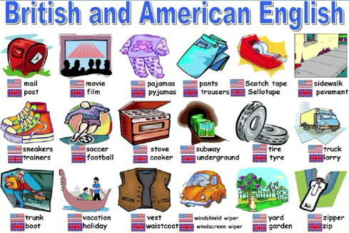

# Lesson 19 Taxi

## 单词讲解

> taxi n. 出租汽车  BrE

cab n. 出租汽车 AmE

BrE = British and English

AmE = American English


> flat n. 公寓房 BrE

apartment AmE





> lonely adj. 偏僻的，人迹罕至的
>
> ​                    感到孤单寂寞的（强调内心的感受）


> Welsh adj. 威尔士的

Wales n. 威尔士


> block n. 一座大楼

a block of flats / apartments 公寓楼；一栋公寓楼

a flat block 一座大楼

an office block 办公大楼；一幢办公大楼

a tower block 高层建筑；塔楼

traffic block / jam 交通堵塞；堵车


## 课文语法讲解

本课重点：

- 复习现在完成时

- 过去分词作定语


> Captain Ben Fawcett **has bought** an unusual taix and **has begun** a new service.

has bought 现在完成时

has begun 现在完成时

```
形式：have / has + done
用法：现在的之前
```


> The "taxi" is a small Swiss aeroplace **called** a "Pilatus Porter".

called 过去分词表示被动（语态），修饰前面的名词（过去分词作后置定语，修饰名词），因此可以翻译成，被叫做。

a used car 一辆二手车

wasted time 浪费时间；虚度光阴；蹉跎岁月

a ploughed field 被耕过的田

a deserted car park 废弃的停车场

a woman called "Dragon Lady" 被叫做母老虎的女士。Dragon 是龙，英语文化中龙代表着凶残的象征。


> The most surprising thing about it, **however**, is that is can land anywhere**:** on snow, water, or even on a ploughed field.

阅读中，如果句子较长，可以通过标点符号帮助简化句子。

- 英语当中，冒号通常表示后面解释说明前面的。
- however 是插入语，也可以去掉。

简化后：

The most surprising thing ... is **that it can land anywhere**.

主语：The most surprising thing

动词：is，单个be动词出现，是系统词

从句：that it can land anywhere

该句子是主系表结构，系统词后是表语从句。

表语从句同宾语从句（参考26课），差别在于宾语从句放在及物动词、介词后；表语从句放在系动词后，尤其是单独的be动词后。


> Captain Fawceet's first passenger was a doctor **who** flew from Birmingham to a lonely village in the Welsh mountains.

who 引出定语从句，修饰限定doctor。

名词doctor后面紧跟定语从句修饰，由于指的是人，所以用了关系词 who 。

fly / flew / flown 原形，过去式，过去分词

from ... to ... 从 ... 到 ...


> **Since then**, Captain Fawcett **has flown** passengers to many unusual places.

has flown，has + 过去分词 构成现在完成时。

现在完成时跨越了现在和过去两个时间段，所以常常会跟表示一个时间段的词组连用。

since then 从过去到现在。

例句：

- He **has lived** in Beijing **since** 1993. 

- 持续的时间，也可以用 for

  He has lived in Beijing **for 20 years**.

- since 还可以加上句子表示从过去到现在

  He has lived in Beijing **since he was born**.


> **Once** he landed on the roof of a block of flats **and on another occasion**, he landed in **a deserted car park**.

on the roof 在屋顶上

a block of flats 一座公寓楼

a deserted car park 一个被废弃的停车场

occasion n. 某次；... 的时候

once ... and on another occasion ... 一次 ... 另一次 ...  表示两次发生的事件，可以通过这个词组连接。


> Captain Fawcett **has just refused** a strange request from a businessman.

refuse a request 拒绝一个请求

has refused 现在完成时

```
现在完成时
have / has + just + done 表示刚刚...（时间间隔不久）
还经常搭配：just already ever never
```


> The man wanted to fly to **Rockall, a lonely island in the Atlantic Ocean**, but Captain Fawcett did not take him because the trip was too dangerous.

同位语：a lonely island in the Atlantic Ocean 解释说明前面的词 Rockall.

该句子表述了三件事，所以想把一个句子写长，可以通过连接词把句子连起来，... but ... because ... 


## 知识拓展

### 现在完成时的常用搭配

- 现在完成时 + since + 过去的时间

  He **has lived** in Beijing **since** 1993. 

- 现在完成时 + since + 过去的动词（一般过去时的句子）

  He has lived in Beijing **since he was born**.

- This / It is the first time (次数) + that 从句(现在完成时).


### 练习

1. His first book `______` good reviews since it came out last year.

   A. receives
   B. is receiving
   C. will receive
   D. has received

> 解析
>
> reviews n. 评论;书评
> came out 上映,出版
>
> has received


2. It is the most boring meeting that I `______` since I came to this company.

   A. attended
   B. had attended
   C. am attending
   D. have attended
   

> 解析
>
> boring meeting 无聊的会议
> attend v. 参加;出席
> came v. come的过去式
> since I came 现在+过去, 现在完成时
>
> have attended


### 四级真题 翻译

This is the first time I `______` (听到他们用法语交流)

> 解析
>
> This is the first time 现在是第一次. 表示第一次听说 ...
>
> This is the first time I have heard them communicating with each other in French.

