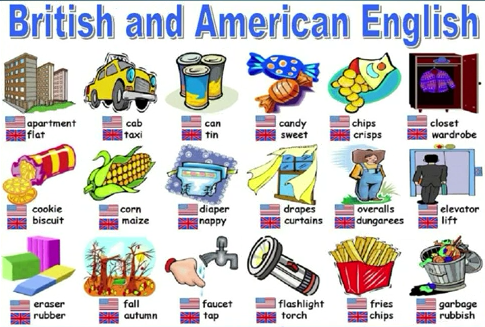
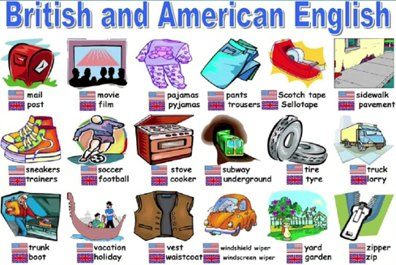

# Lesson 29 Taxi

Does Captain Fawcett think any trip is too dangerous?

Captain Ben Fawcett has bought an unusual taxi and has begun a new service. The 'taxi' is a small Swiss aeroplane called a 'Pilatus Porter'. This wonderful plane can carry seven passengers. The most surprising thing about it, however, is that it can land anywhere: on snow, water, or even on a ploughed field. Captain Fawcett' s first passenger was a doctor who flew from Birmingham to a lonely village in the Welsh mountains. Since then, Captain Fawcett has flown passengers to many unusual places. Once he landed on the roof of a block of flats and on another occasion, he landed in a deserted car park. Captain Fawcett has just refused a strange request from a businessman. The man wanted to fly to Rockall,  a lonely island in the Atlantic Ocean, but Captain Fawcett did not take him because the trip was too dangerous.


## 单词讲解

1. taxi n. 出租汽车  BrE

   cab n. 出租汽车 AmE

   BrE = British and English

   AmE = American English


2. flat n. 公寓房 BrE

   apartment AmE








3. lonely adj. 偏僻的，人迹罕至的

    感到孤单寂寞的（强调内心的感受）


4. Welsh adj. 威尔士的

   Wales n. 威尔士


5. block

   - n. 一座大楼

     - a block of flats / apartments 公寓楼；一栋公寓楼

     - a flat block 一座大楼

     - an office block 办公大楼；一幢办公大楼

     - a tower block 高层建筑；塔楼
   
   - v. 堵塞
     - traffic block / jam 交通堵塞；堵车


## 课文语法讲解

本课重点：

- 复习现在完成时

- 过去分词作定语


1. Captain Ben Fawcett **has bought** an unusual taxi and **has begun** a new service.

   - has bought 和 has begun 现在完成时

     形式：have / has + done
   
     用法：现在的之前
   

   
2. The "taxi" is a small Swiss aeroplane **called** a "Pilatus Porter".

   - called 过去分词表示被动（语态），修饰前面的名词（过去分词作后置定语，修饰名词），因此可以翻译成，被叫做。

   - a used car 一辆二手车

   - wasted time 浪费时间；虚度光阴；蹉跎岁月
- a ploughed field 被耕过的田
   - a deserted car park 废弃的停车场
- a woman called "Dragon Lady" 被叫做母老虎的女士。Dragon 是龙，英语文化中龙代表着凶残的象征。


3. The most surprising thing about it, **however**, is that is can land anywhere**:** on snow, water, or even on <u>a ploughed field</u>.

    阅读中，如果句子较长，可以通过标点符号帮助简化句子。

    - 英语当中，冒号通常表示后面解释说明前面的。
    - however 是插入语，也可以去掉。

    简化后：

    The most surprising thing ... is **that it can land anywhere**.

    主语：The most surprising thing

    动词：is，单个be动词出现，是系统词

    从句：that it can land anywhere

    该句子是主系表结构，系统词后是表语从句。

    表语从句同宾语从句（参考26课），差别在于宾语从句放在及物动词、介词后；表语从句放在系动词后，尤其是单独的be动词后。


4. Captain Fawceet's first passenger was a doctor **who** <u>flew from Birmingham to a lonely village</u> in the Welsh mountains.

    who 引出定语从句，修饰限定doctor。

    名词 doctor 后面紧跟定语从句修饰，由于指的是人，所以用了关系词 who 。

    fly / flew / flown 原形，过去式，过去分词

    from ... to ... 从 ... 到 ...


5. **Since then**, Captain Fawcett **has flown** passengers to many unusual places.

    has flown，has + 过去分词 构成现在完成时。

    现在完成时跨越了现在和过去两个时间段，所以常常会跟表示一个时间段的词组连用。

    since then 从过去到现在。**出现 since 要搭配现在完成时。**

    例句：

    - He **has lived** in Beijing **since** 1993. 

    - 持续的时间，也可以用 for

      He has lived in Beijing **for 20 years**.

    - since 还可以加上句子表示从过去到现在

      He has lived in Beijing **since he was born**.


6. **Once** he landed on the roof of a block of flats **and on another occasion**, he landed in **a deserted car park**.

   on the roof 在屋顶上

   a block of flats 一座公寓楼

   a deserted car park 一个被废弃的停车场

   occasion n. 某次；... 的时候

   once ... and on another occasion ... 一次 ... 另一次 ...  表示两次发生的事件，可以通过这个词组连接。


7. Captain Fawcett **has just refused** a strange request from a businessman.

   refuse a request 拒绝一个请求

   deny 否认

   has refused 现在完成时

   ```
   现在完成时
   have / has + just + done 表示刚刚...（时间间隔不久）
   还经常搭配：just already ever never
   ```

   

8. The man wanted to fly to **Rockall, a lonely island in the Atlantic Ocean**, but Captain Fawcett did not take him because the trip was too dangerous.

   - 同位语：a lonely island in the Atlantic Ocean 解释说明前面的词 Rockall.

   - 该句子表述了三件事，所以想把一个句子写长，可以通过连接词把句子连起来，... but ... because ... 
   - take / bring / fetch 都有拿的意思
     - take 从这拿走
     - bring 从别的地方拿来
     - fetch 从这到别的地方去取，再拿回来。
   - very / too
     - very 非常，程度比普通多一点点。
     - too 程度过于 ...，有否定的含义，过犹不及。


## 知识拓展

现在完成时.md


### 练习一

1. His first book `______` good reviews since it came out last year.

   A. receives
   B. is receiving
   C. will receive
   D. has received
   
   > 解析
   >
   > reviews n. 评论;书评
   > came out 上映,出版
   >
   > has received


2. It is the most boring meeting that I `______` since I came to this company.

   A. attended
   B. had attended
   C. am attending
   D. have attended
   
   > 解析
   >
   > boring meeting 无聊的会议
   > attend v. 参加;出席
   > came v. come的过去式
   > since I came 现在+过去, 现在完成时
   >
   > have attended


### 练习二

1. I `______` Mr. Smith since he moved to Shanghai. （中考真题）

   A. didn't hear from

   B. don't hear from

   C. won't hear from

   D. haven't heard from

   > 答案：D
   >
   > 解析：现在完成时 + since + moved

2. The Harry Potter books `______` pretty popular since they were published.（中考真题）

   A. become

   B. will become

   C. have become

   D. are becoming

   > 答案：C
   >
   > 解析：现在完成时 + since + published

3. His first novel `______` good reviews since it came out last month. （高考真题）

   A. receives

   B. is receiving

   C. will receive

   D. has received

   > 答案：D
   >
   > 解析：现在完成时 + since + came

4. It is the most instructive lecture that I `______` since I came to this school.

   A. attended

   B. had attended

   C. am attending

   D. have attended

   > 答案：D
   >
   > 解析：现在完成时 + since + came


### 四级真题 翻译

This is the first time I `______` (听到他们用法语交流)

> 解析
>
> This is the first time 现在是第一次. 表示第一次听说 ...
>
> This is the first time I have heard them communicating with each other in French.

