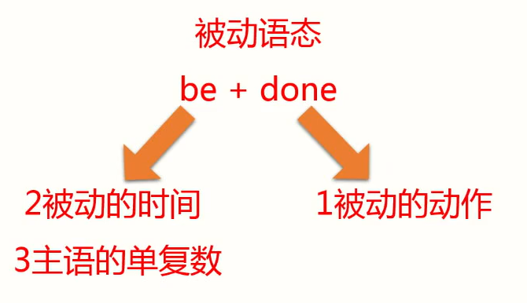

# 被动语态（非常重要）

由来：主动表达不了，没有动作的发出者（主语），就写成被动的。

范围：

- 及物动词才能变成被动语态。

- 不及物动词+介词构成词组，也可以变成被动语态。

形式：

```
be + done
```

三个步骤



| be            | done        |
| ------------- | ----------- |
| 2被动的时间   | 1被动的动作 |
| 3主语的单复数 |             |

把be变成各种对应的时态，来表示对应的时间。


### 例句1

填充句子：教室每天都打扫。

> Classrooms (clean) every day.


解析

- 教室被打扫，clean动词变成过去分词cleaned。

- 时间every day，每天，经常性、习惯性的事，使用一般现在时。

- 一般现在时，be动词有三种 am / is / are。根据主语单复数，Classrooms是复数，选用are。


写法

> Classrooms are cleaned every day.


### 例句2

填充句子：这座新的大楼去年建造的。

> The new building (build) last year.

解析

- 动词 build 变成过去分词 built
- 时间 last year 去年。过去时be动词可选 was / were
- 主语 是单数，be动词用was

写法

> The new building was built last year.


### 例句3

| 被动语态（be + done）           | -                  |
| ------------------------------- | ------------------ |
| He **is** beaten every day.     | 他每天被打。       |
| He **was** beaten yesterday.    | 他昨天被打了。     |
| He **will be** beaten tomorrow. | 他明天将要被打。   |
| He **is being** beaten now.     | 他现在正在被打。   |
| He **has been** beaten.         | 他现在已经被打了。 |


### 例句4

一个新的机器现在已经被发明了。

> A new machine **has been invented**.


人们现在正在被广告所影响。

> People **are being influenced** by advertisements.


### 助记公式

| -                | -                     |
| ---------------- | --------------------- |
| 现在进行时的被动 | am/is/are  being done |
| 现在完成时的被动 | have/has  been done   |


## 被动和情态动词相结合

情态动词不会单独用，后面搭配动词原形。

| 被动和情态动词相结合      | -                |
| ------------------------- | ---------------- |
| Planes **are heard**.     | 飞机被听见       |
| Planes **can be** heard.  | 飞机能够被听见   |
| Planes **may be** heard.  | 飞机可能被听见   |
| Planes **must be** heard. | 飞机肯定会被听见 |

练习

- 这封信必须马上寄出。

The letter **must be sent** immediately.

immediately adv. 立刻，马上


- 天气不能被人们所控制。

The weather **cannot be controlled** by people.

by 被动中强调动作的发出者


## 参考课文

## 参考课文

- Lesson 10 not for jazz
- Lesson 20 Mad or not