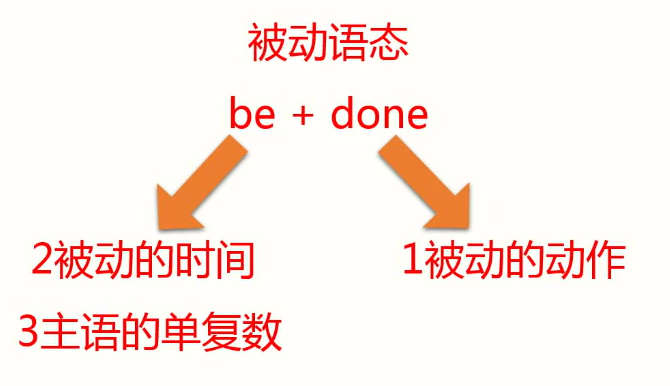

# 被动语态（非常重要）

## 由来

主动表达不了，没有动作的发出者（主语），就写成被动的。


例：

狗吃了那个蛋糕。---> 蛋糕被吃了。

The dog ate the cake.


## 范围

- 及物动词才能变成被动语态。

- 不及物动词+介词构成词组，也可以变成被动语态。


## 形式

```
be + done
```


### 三个步骤



| be            | done                    |
| ------------- | ----------------------- |
| 2被动的时间   | 1被动的动作（过去分词） |
| 3主语的单复数 |                         |

1. 先看被动的动作，过去分词。
2. 把be变成各种对应的时态，来表示对应的时间。
3. 根据主语的单复数使用be。


### 例句1

填充句子：教室每天都打扫。

Classrooms `______` (clean) every day.

> 解析
>
> 1. 教室被打扫，clean 动词变成过去分词 cleaned。
>
> 2. 时间 every day，每天，经常性、习惯性的事，使用一般现在时。
>
> 3. 一般现在时，be 有三种 am / is / are。根据主语单复数，Classrooms 是复数，选用 are。


写法

Classrooms **are cleaned** every day.


### 例句2

填充句子：这座新的大楼去年建造的。

The new building `______` (build) last year.

> 解析
>
> 1. 动词 build 变成过去分词 built
>
> 2. 时间 last year 去年，be 的过去式可选 was / were
>
> 3. 主语 是单数，be 用 was

写法

The new building **was built** last year.


## 被动语态+时态

| 被动语态           | be + done                       | 时态       |
| ------------------ | ------------------------------- | ---------- |
| 他每天被打。       | He **is** beaten every day.     | 现在时     |
| 他昨天被打了。     | He **was** beaten yesterday.    | 过去时     |
| 他明天将要被打。   | He **will be** beaten tomorrow. | 将来时     |
| 他现在正在被打。   | He **is being** beaten now.     | 现在进行时 |
| 他现在已经被打了。 | He **has been** beaten.         | 现在完成时 |


### 例句

1. English `______` (speak) all over the world.

   > 现在时+被动语态：is spoken

   

2. The stadium `______` (build) in 1998.

   > 过去时+被动语态：was built

   

3. 罗马不是一天建成的。

   Rome **was not built** in a day.

   

4. 一个新的机器现在已经被发明了。

   A new machine **has been invented**.

   

5. 人们现在正在被广告所影响。

   > 现在进行时+被动语态

   People **are being influenced** by advertisements.


### 助记公式

| -                | -                     |
| ---------------- | --------------------- |
| 现在进行时的被动 | am/is/are  being done |
| 现在完成时的被动 | have/has  been done   |


## 被动和情态动词相结合

情态动词不会单独用，后面搭配动词原形。

| 被动和情态动词相结合      | -                |
| ------------------------- | ---------------- |
| Planes **are heard**.     | 飞机被听见       |
| Planes **can be** heard.  | 飞机能够被听见   |
| Planes **may be** heard.  | 飞机可能被听见   |
| Planes **must be** heard. | 飞机肯定会被听见 |

练习

- 这封信必须马上寄出。

The letter **must be sent** immediately.

immediately adv. 立刻，马上


- 天气不能被人们所控制。

The weather **cannot be controlled** by people.

by 被动中强调动作的发出者


## 参考课文

- Lesson 10 not for jazz
- Lesson 20 Mad or not