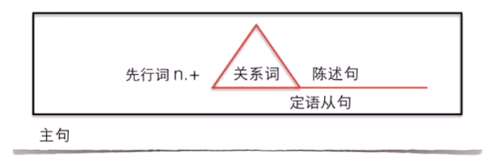

# 定语从句

含义：一个句子去做定语修饰限定名词。

位置：放在所修饰的名词后。

写法：

This is <u>the job</u>.   I have dreamed of <u>the job</u> for years.

This is <u>the job</u>   <u>which I have dreamed of for years.</u>
            先行词    关系词
                                               定语从句

定语从句关系词的选择，看先行词：

| 先行词                         | 关系词            |
| ------------------------------ | ----------------- |
| 事 / 物                        | which / that      |
| 人                             | who / whom / that |
| 人 / 物 （“某人的 / 某物的“ ） | whose             |
| 时间                           | when              |
| 地点                           | where             |
| 原因                           | why               |

定语从句关系词的几点注意：

- 定语从句的关系词每一个都作成分，包括that。
- whom指人，只能在作宾语时使用。
- 关系词在定语从句中作宾语时，可以省略（只针对于人或事物）。

定语从句练习：

1. I have a class `______` begins at 8:00 am.

   > 答案：which / that
   >
   > 解析：
   >
   > 先行词 a class 表示一节课，是事物。
   >
   > 关系词能否省略？
   >
   > begins 是动词，说明缺主语，因此关系词需要作主语，所以不可以省略。

2. The lawyer `______` my brother called didn't answer the phone.

   > 答案：(who / that / whom)
   >
   > 解析：
   >
   > 想知道填空中的关系词作说明成分，可以通过代入法判断是否作宾语。
   >
   > 填空中的关系词等于先行词 lawyer ，我们把它代入从句中，变成 my brother called lawyer，是作宾语。因此，可以使用 whom，也可以省略。

3. My daughter asked me a question `______` I couldn't answer.

   > 答案：(which / that)
   >
   > 解析：a question 是事物，通过代入法判断是作宾语，因此可以省略。

4. Leo is the student `______` <u>bike was stolen</u>.

   > 答案：whose
   >
   > 解析：
   >
   > 先行词 the student，定语从句 bike ...，含义是谁的自行车，这里指学生的自行车。

5. Australia is one of the few countries `______` <u>people drive on the left</u>.

   > 答案：where
   >
   > 解析：人们在左边开车，在这个国家，表示地点。
   >
   > where 在定语从句中也作成分，只不过补充说明地点（地点状语），不像作主语和宾语那么明显。

6. Sunday is the day `______` <u>people usually don't go to work</u>.

   > 答案：when
   >
   > 解析：先行词表示时间。作时间状语。

7. Is there any particular reason `______` you can't come?

   > 答案：why
   >
   > 解析：有什么特殊原因，为什么你不能来？先行词表示原因。

8. I lost the book `______`.

   我弄丢了上周从图书馆借的书。

   > 答案：(which / that) I borrowed from the library last week.
   >
   > 解析：
   >
   > 先行词 book 是事物。
   >
   > which / that 是否可以省略？
   >
   > 通过代入法 I borrowed the book ... 是作宾语，因此可省略。

9. The woman `______` was feeding pigeons.

   我在公园看见那位女士正在喂鸽子。

   > 答案：(who / that / whom) I saw in the park.
   >
   > 解析：
   >
   > 先行词 woman 是人。
   >
   > 我看见那位女士，作宾语，可省略。

10. I cannot remember the day `______`.

    我记不起上一次我们是什么时候碰面的。

    > 答案：when we met last time.
    >
    > 解析：先行词 the day 是时间。

## 参考课程

- Lesson 28 No parking